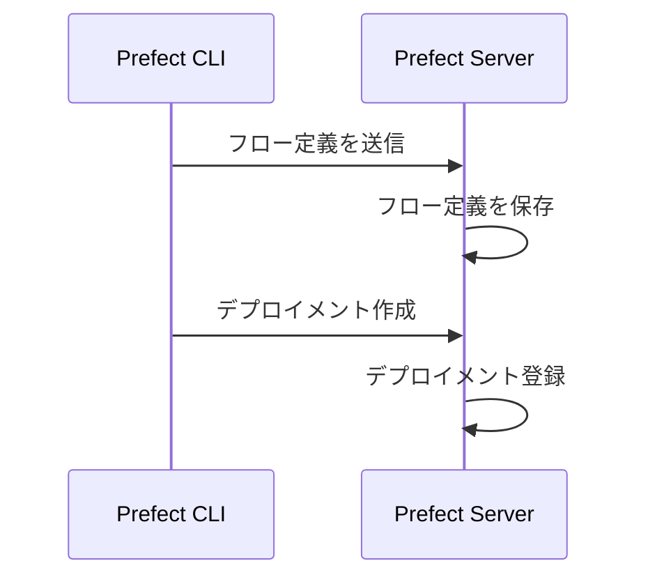
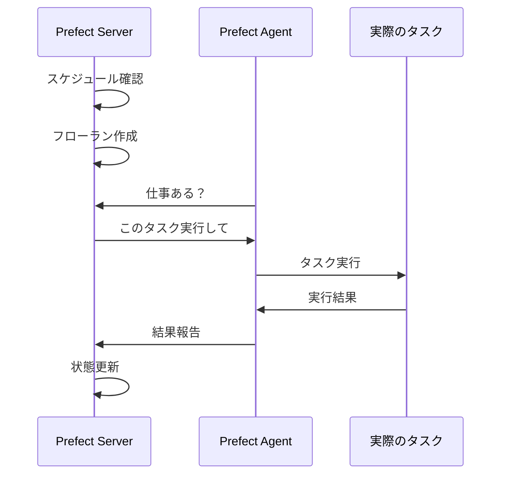
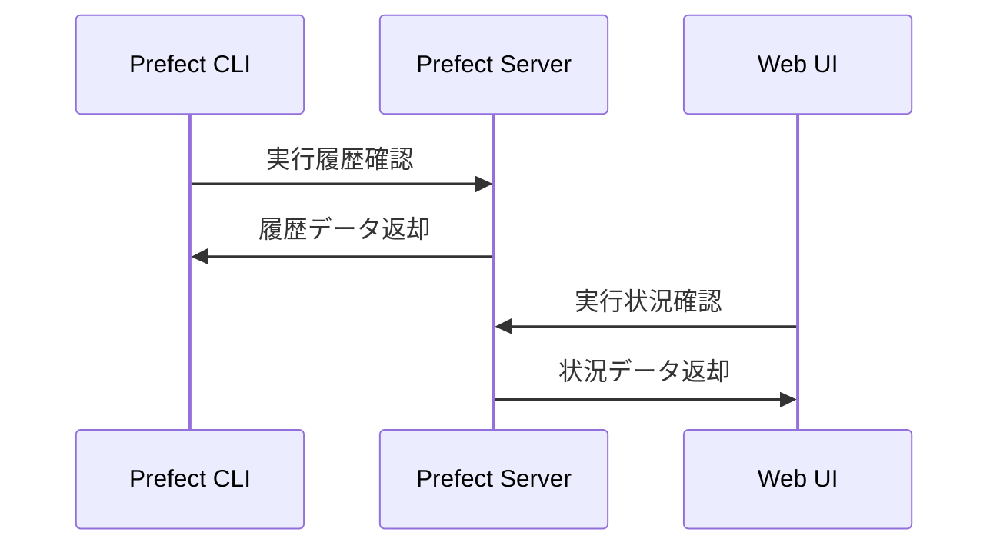

# Prefect コンポーネント解説

Prefect の Server、Agent、CLI の役割と関係性について詳しく説明します。

## 🏗️ 全体構成図

```
┌─────────────────┐    ┌─────────────────┐    ┌─────────────────┐
│   Prefect CLI   │    │ Prefect Server  │    │ Prefect Agent   │
│                 │    │                 │    │                 │
│ ・デプロイメント │◄──►│ ・中央管理      │◄──►│ ・タスク実行    │
│ ・フロー登録    │    │ ・スケジューリング│    │ ・ワーカー      │
│ ・設定管理      │    │ ・状態管理      │    │ ・プロセス管理  │
│ ・手動実行      │    │ ・Web UI提供    │    │                 │
└─────────────────┘    └─────────────────┘    └─────────────────┘
         │                        │                        │
         └────────── API経由で連携 ──────────────────────────┘
```

## 🖥️ Prefect Server

### 役割

**「Prefect の頭脳・司令塔」**

- 📊 **中央管理システム**: すべてのワークフローを統括管理
- 🎯 **スケジューリング**: いつ、どのワークフローを実行するか決定
- 📈 **状態管理**: 実行中・完了・失敗などの状態を追跡
- 🌐 **Web UI 提供**: ブラウザでの管理画面
- 🔌 **API 提供**: 外部システムとの連携窓口

### 具体的な機能

```bash
# Serverが管理する情報
├── フロー定義 (Flow)
├── デプロイメント (Deployment)
├── フローラン (Flow Run) - 実行履歴
├── タスクラン (Task Run) - タスク実行履歴
├── ワークプール (Work Pool) - Agent管理
└── スケジュール (Schedule) - 定期実行設定
```

### 実際の動作例

```python
# Server内部での動作イメージ
1. フロー定義を受信・保存
2. スケジュールに基づいて実行タイミングを判断
3. Agentに「このタスクを実行して」と指示
4. Agentからの結果を受信・記録
5. Web UIに状況を表示
```

## 🤖 Prefect Agent

### 役割

**「Prefect の手足・実行者」**

- ⚡ **タスク実行**: 実際のワークフローを動かす
- 👂 **Server 監視**: Server からの指示を常に待機
- 🏃 **ワーカー機能**: 複数タスクを並列実行
- 🔄 **リトライ処理**: 失敗時の再実行
- 📡 **結果報告**: 実行結果を Server に送信

### 動作の流れ

```python
# Agent内部での動作イメージ
while True:
    # 1. Serverに「やることある？」と問い合わせ
    pending_work = check_for_work()

    if pending_work:
        # 2. タスクを受け取って実行
        result = execute_task(pending_work)

        # 3. 結果をServerに報告
        report_result(result)

    # 4. 少し待ってまた問い合わせ
    time.sleep(polling_interval)
```

### ワークプールとの関係

```bash
# Agent は特定のワークプールを監視
Agent A → Work Pool "default" を監視
Agent B → Work Pool "high-priority" を監視
Agent C → Work Pool "gpu-tasks" を監視
```

## 💻 Prefect CLI

### 役割

**「Prefect の操縦士・管理者」**

- 🛠️ **開発支援**: フロー作成・テスト・デバッグ
- 📦 **デプロイメント管理**: フローの登録・更新・削除
- ⚙️ **設定管理**: Server 接続、環境設定
- 📊 **監視・確認**: 実行状況確認、ログ閲覧
- 🎮 **手動操作**: 手動でのワークフロー実行

### 主要コマンド

```bash
# === 設定系 ===
prefect config set PREFECT_API_URL="http://localhost:4200/api"
prefect config view

# === デプロイメント系 ===
prefect deployment build flows/my_flow.py:my_function --name "My Deployment"
prefect deployment apply my-deployment.yaml
prefect deployment ls

# === 実行系 ===
prefect deployment run "My Flow/My Deployment"
prefect flow-run ls
prefect flow-run logs <flow-run-id>

# === 監視系 ===
prefect work-pool ls
prefect agent start -q default
```

## 🔄 三者の連携フロー

### 1. 開発・デプロイフェーズ



### 2. 実行フェーズ



### 3. 監視フェーズ



## 🏠 我々の環境での具体例

### Docker Compose での役割分担

```yaml
# compose.yml での構成
prefect-server: # 司令塔
  ports: ["4200:4200"] # Web UI + API

prefect-agent: # 実行者
  depends_on: [prefect-server]

prefect-cli: # 管理者
  profiles: ["cli"] # 必要時のみ起動
```

### 実際の使用例

```bash
# 1. CLI: デプロイメント確認
docker compose run --rm prefect-cli prefect deployment ls

# 2. CLI: フロー実行指示
docker compose run --rm prefect-cli prefect deployment run "Hello World Flow/Hello World Deployment"

# 3. Server: 指示を受けてAgentに配布
# （自動処理）

# 4. Agent: タスク実行
# （自動処理）

# 5. Server: 結果をWeb UIに表示
# http://localhost:4200 で確認可能
```

## 🔧 トラブルシューティングの観点

### Server の問題

```bash
# Serverが起動しない
docker compose logs prefect-server

# APIが応答しない
curl http://localhost:4200/api/health
```

### Agent の問題

```bash
# Agentがタスクを取得しない
docker compose logs prefect-agent

# ワークプール設定確認
docker compose run --rm prefect-cli prefect work-pool ls
```

### CLI の問題

```bash
# Server接続設定確認
docker compose run --rm prefect-cli prefect config view

# 接続テスト
docker compose run --rm prefect-cli prefect deployment ls
```

## 💡 よくある質問

### Q: Server が止まったらどうなる？

A: Agent は動き続けますが、新しい指示を受け取れません。既に実行中のタスクは継続されます。

### Q: Agent が止まったらどうなる？

A: Server は正常に動作しますが、タスクが実行されません。Agent が復旧すると未実行タスクを処理します。

### Q: CLI がなくても動く？

A: はい。デプロイメント登録後は、Schedule や API 経由で実行できます。CLI は管理・開発用です。

### Q: 複数 Agent は可能？

A: 可能です。負荷分散や冗長化のために複数 Agent 起動できます。

### Q: Web UI で全部できる？

A: 基本的な監視・実行は可能ですが、デプロイメント作成などは CLI が必要です。

## 🎯 まとめ

| コンポーネント | 例え           | 主な責任         | 必須度 |
| -------------- | -------------- | ---------------- | ------ |
| **Server**     | 会社の本社     | 計画・管理・指示 | ⭐⭐⭐ |
| **Agent**      | 現場の作業員   | 実際の作業実行   | ⭐⭐⭐ |
| **CLI**        | 管理者・開発者 | 設定・デプロイ   | ⭐⭐   |

**Server + Agent = 最小構成で動作**  
**CLI = 開発・管理時に必要**

これらが連携することで、強力で柔軟なワークフロー管理システムが実現されます！
